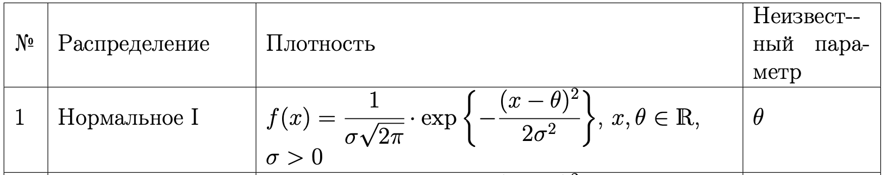
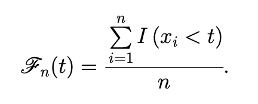
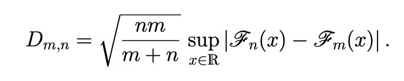
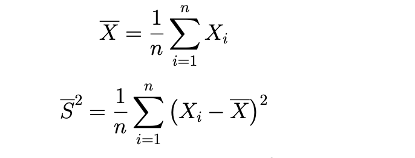

Домашнее задание по математической статистике  

  
  

Задания: 

а) Характеристики вероятностных распределений  

1. Описание основных характеристик распределения  
Для каждого из выбранного распределения необходимо выписать его основные характеристики:  
◃ функция распределения,   
◃ математическое ожидание,    
◃ дисперсия,  
◃ квантиль уровня γ,  
Все выписываемые характеристики должны сопровождаться теоретическими выкладками.  

2. Поиск примеров событий, которые могут быть описаны выбранными случайными величинами  
Для каждого из выбранных распределений необходимо  
◃ привести пример интерпретации распределения – описания события, исходы в котором подчиняются выбранному распределению;   
◃ известные соотношения между распределениями;  
К интерпретациям будем относить математические модели, описываемые данным распределением.  

3. Описание способа моделирования выбранных случайных величин  
Для каждого из двух распределений (дискретное и непрерывное) необходимо описать способ моделирования выборок с заданными распределениями.  
Полагая, что у каждого есть источник непрерывных случайных величин, распределённых равномерно на отрезке [0, 1] (random), необходимо описать и обосновать процедуру получения нужного распределения на основе равномерной выборки.   

б) Основные понятия математической статистики  
Данное домашнее задание является продолжением предыдущего домашнего задания посвящено закреплению пройденного материала по основам математической статистики.  
  
1. Генерация выборок выбранных случайных величин  
Для каждой из выбранных случайных величин необходимо построить по 5 выборок следующих объемов n = {5, 10, 100, 200, 400, 600, 800, 1000}.  

2. Построение эмпирической функции распределения  
Для каждой сгенерированной выборки необходимо построить график эмпирической функции распределения  
  
Графики необходимо привести в отчете. На одном графике необходимо отобразить эмпирические функции распределения для каждого из объемов выборки независимо и график функции распределения случайной величины.  
Для каждой пары построенных эмпирических Fn(x) и Fm(x), n,m ∈ {5, 10, 100, 200, 400, 600, 800, 1000} необходимо вычислить   
   

3. Построение гистограммы и полигона частот  
Для каждого распределения и для каждого n необходимо построить и привести в отчете:
◃ полигон частот,  
◃ сравнение с плотностью распределения для непрерывных распределений и функцией вероятности для дискретных распределений.  
Необходимо пояснить полученные графики.  

4. Вычисление выборочных моментов  
Для каждого сгенерированной выборки необходимо выписать значение выборочного среднего и выборочной дисперсии  
  
Какими свойствами данные оценки обладают?  
Также необходимо сравнить значения полученных оценок с истинными значениями математического ожидания и дисперсии.   

в) Построение точечных оценок параметра распределения

Задание состоит из следующих пунктов:

1. Получение оценок методом моментов и методом максимального правдоподобия   
Для каждого из распределений (дискретное и непрерывное) необходимо получить оценки неизветного параметра методом моментов и методом максимального правдоподобия.   
Для каждой выборки, сгенерированной в пункте 2.1, необходимо привести значения полученных оценок.    

2. Поиск оптимальных оценок   
Для каждого из распределений (дискретное и непрерывное) необходимо предложить параметрическую функцию τ(θ), для которой существует оптимальная оценка.  
Замечание 3.1 В случае, если параметрическая функция τ(θ) не равна оцениваемому параметру θ, необходимо (если это возможно) также построить оптимальную оценку для θ.  
Для каждой выборки, сгенерированной в пункте 2.1, необходимо привести значения полученных оценок.  

г) Проверка статистических гипотез  

1. Проверка гипотезы о виде распределения  
Для каждой выборки, сгенерированной в пункте 2.1 необходимо рассмотреть следующие статистики:  
◃ Критерий согласия Колмогорова (Смирнова),  
◃ Критерий согласия хи-квадрат,  
◃ Критерий согласия Колмогорова (Смирнова) для сложной гипотезы (в условиях когда неизвестен параметр распределения),  
◃ Критерий согласия хи-квадрат для сложной гипотезы (в условиях когда неизвестен параметр распределения).  

2. Проверка гипотезы об однородности выборок   
На основе построенных значений Dm,n в пункте 2.2 сделать вывод об однородности сгенерированных выборок.  
 

